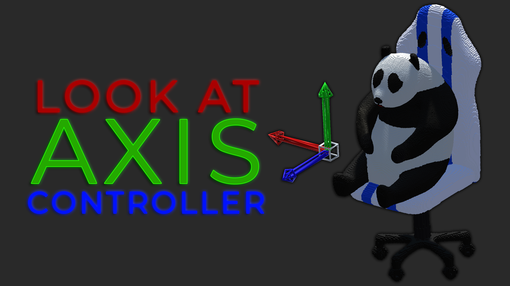
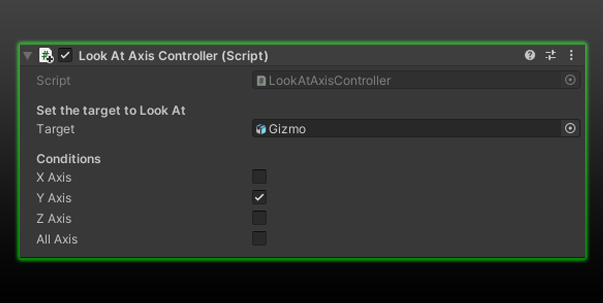

<h3 align="center">Look At Axis Controller</h3>

<!-- PROJECT LOGO -->

Easily set the axis for your LookAt functions.

<!-- TABLE OF CONTENTS -->

  
Table of Contents

  <ol>
    <li><a href="#about">About</a></li>
    <li><a href="#functions">Functions</a></li>
    <li><a href="#getting-started">Getting Started</a></li>
    <li><a href="#additional-notes">Additional Notes</a></li>
    <li><a href="#example">Example</a></li>
    <li><a href="#contact">Contact</a></li>
  </ol>

<!-- ABOUT THE PROJECT -->
## About

 
Ever wanted to only look at on a specific axis?
 
This [code](https://github.com/hamdanbasri/LerpControl/blob/main/LerpControl.cs) is here just to do that.

<!-- FUNCTIONS -->
## Functions
* Set a specific axis to look at your target.

<!-- GETTING STARTED -->
## Getting Started

* Open Unity and add a <strong>Cube</strong> to the scene and rename it to <strong>Head</strong>.
* Attach the [LookAtAxisController.cs](https://github.com/hamdanbasri/LerpControl/blob/main/LerpControl.cs) script to the <strong>Head</strong> as a component.
* Add another <strong>Cube</strong> to the scene and name it to <strong>LookAtTarget</strong>.
* Click on Head in the hierarchy.
* Drag the <strong>LookAtTarget</strong> in the Hierarchy on to the Target section in the inspector.
* Select an axis to specificy the direction to look at.
* Press <strong>Play</strong> in your editor, move around the Target and see the magic of <strong>LookAtAxisController</strong>.

## Additional Notes
* All axis is the same as the normal Look At function.

<!-- USAGE EXAMPLES -->
## Example

Quick and easy setup.

 
        <table>
        <tr>
            <td>Variable</td>
            <td>Annotation</td>
            </td>
        <tr>
            <td>Target</td>
            <td>Drag and drop the target to Look At.</td>
        </tr>
        <tr>
            <td>X Axis</td>
            <td>Look at only on the X-Axis.</td>
        </tr>
        <tr>
            <td>Y Axis</td>
            <td>Look at only on the Y-Axis.</td>
        </tr>
        <tr>
            <td>Z Axis</td>
            <td>Look at only on the Z-Axis.</td>
        </tr>
            <td>All Axis</td>
            <td>Look at on all Axis.</td>
        </tr>
        </table>

<!-- CONTACT -->
## Contact

[![LinkedIn][linkedin-shield]][linkedin-url]

(<a href="#readme-top">back to top</a>)

<!-- MARKDOWN LINKS & IMAGES -->
<!-- https://www.markdownguide.org/basic-syntax/#reference-style-links -->
[linkedin-shield]: https://img.shields.io/badge/-LinkedIn-black.svg?style=for-the-badge&logo=linkedin&colorB=555
[linkedin-url]: https://linkedin.com/in/hamdanbasri

